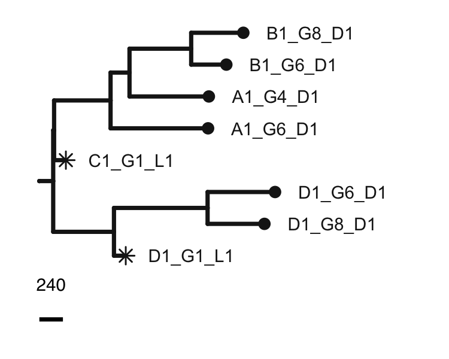
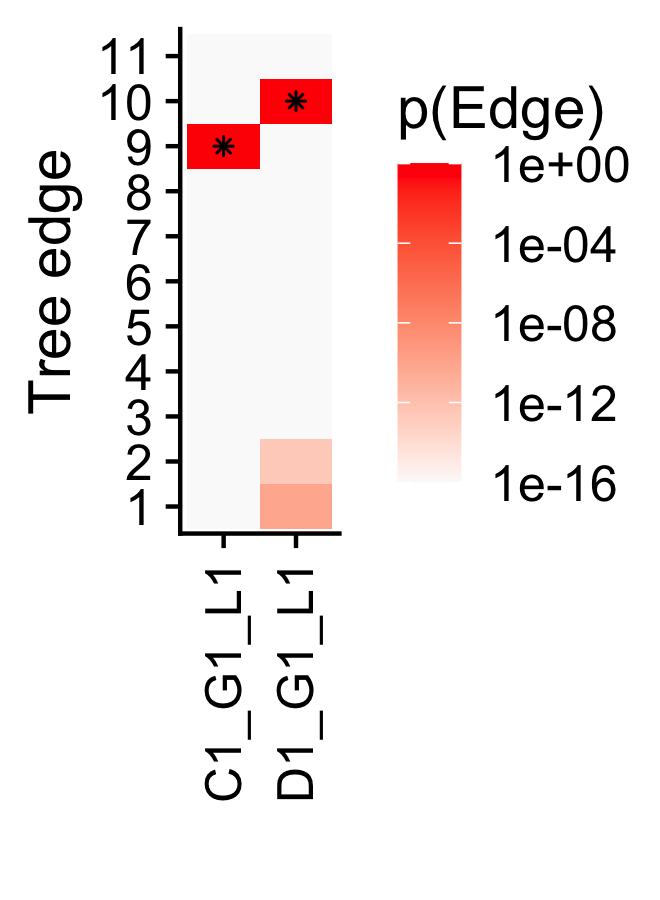
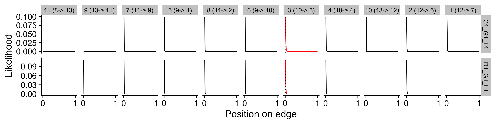
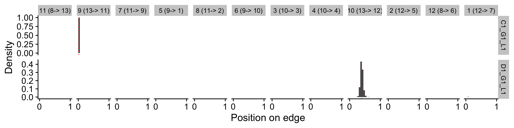
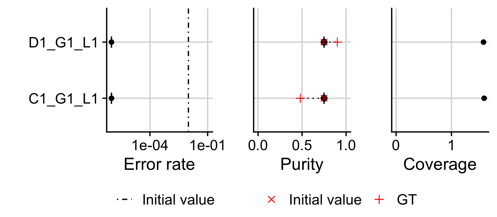

# MLLPT 

<!-- badges: start -->

[](https://github.com/T-Heide/MLLPT/actions)
[](https://codecov.io/gh/T-Heide/MLLPT)
[](https://www.codefactor.io/repository/github/t-heide/mllpt/overview/master)
<!-- badges: end -->

Maximum likelihood assignment of low-pass samples (MLLPT)

------------------------------------------------------------------------

#### Installation

``` r
# install.packages("devtools")
devtools::install_github('dombennett/treeman') # package requires newest version of treeman (not on CRAN)
devtools::install_github("T-Heide/MLLPT")
```

------------------------------------------------------------------------

#### Help and support

[](https://t-heide.github.io/MLLPT/)

------------------------------------------------------------------------

#### Getting started

``` r
library(MLLPT)
library(phangorn)
```

    ## Loading required package: ape

##### 1) Input data

``` r
data("example_lp_data", package="MLLPT") # example dataset included in the package
```

``` r
# 1/3 a phylogenetic tree
print(example_lp_data$tree)
```

    ## 
    ## Phylogenetic tree with 7 tips and 6 internal nodes.
    ## 
    ## Tip labels:
    ##   EPICC_C518_A1_G4_D1, EPICC_C518_A1_G6_D1, EPICC_C518_B1_G6_D1, EPICC_C518_B1_G8_D1, EPICC_C518_D1_G6_D1, GL, ...
    ## 
    ## Rooted; includes branch lengths.

``` r
# 2/3 a phylo object (with id attribute)
print(example_lp_data$phydata)
```

    ## 7 sequences with 7152 character and 19 different site patterns.
    ## The states are 0 1

``` r
head(attr(example_lp_data$phydata, "id")) # a non default attribute of mutation ids!
```

    ## [1] "1X0" "1X1" "1X2" "1X3" "1X4" "1X5"

``` r
# 3/3 a list of sample data
str(example_lp_data$samples)
```

    ## List of 2
    ##  $ EPICC_C518_C1_G1_L1:'data.frame': 40452 obs. of  7 variables:
    ##   ..$ clone    : num [1:40452] 1 1 1 1 1 1 1 1 1 1 ...
    ##   ..$ alt_count: num [1:40452] 0 0 0 0 0 0 0 1 1 0 ...
    ##   ..$ depth    : num [1:40452] 0 1 0 1 1 1 1 2 2 0 ...
    ##   ..$ id       : chr [1:40452] "1X0" "1X1" "1X2" "1X3" ...
    ##   ..$ ccf      : num [1:40452] 1 1 1 1 1 1 1 1 1 1 ...
    ##   ..$ vaf      : num [1:40452] NaN 0 NaN 0 0 0 0 0.5 0.5 NaN ...
    ##   ..$ cn_total : num [1:40452] 2 2 2 2 2 2 2 2 2 2 ...
    ##  $ EPICC_C518_D1_G1_L1:'data.frame': 36212 obs. of  7 variables:
    ##   ..$ clone    : num [1:36212] 1 1 1 1 1 1 1 1 1 1 ...
    ##   ..$ alt_count: num [1:36212] 0 1 0 1 0 0 0 1 0 1 ...
    ##   ..$ depth    : num [1:36212] 0 1 1 1 3 0 0 2 1 4 ...
    ##   ..$ id       : chr [1:36212] "1X0" "1X1" "1X2" "1X3" ...
    ##   ..$ ccf      : num [1:36212] 1 1 1 1 1 1 1 1 1 1 ...
    ##   ..$ vaf      : num [1:36212] NaN 1 0 1 0 NaN NaN 0.5 0 0.25 ...
    ##   ..$ cn_total : num [1:36212] 2 2 2 2 2 2 2 2 2 2 ...

##### 2) Add LP samples

``` r
set.seed(123)

tree_with_lp_added = 
  with(example_lp_data,  {
    MLLPT::add_lowpass_sampled(
      tree = tree, 
      phydata = phydata, 
      sample_data = samples, 
      return_details = TRUE, 
      n_bootstraps = 1000, 
      n_cores = 8
    )
  })
```

    ## -=-=-=-=-=-=-=-=-=-=-=-=-=-=-=-=-=-=--=-=-=-=-=-=-=-=-=-=-=-=-=
    ## 
    ## Processing sample: EPICC_C518_C1_G1_L1 (1/2)
    ## 
    ## Bootstrapping data 1000 times...
    ## 
    ## New values:
    ## 
    ## - Background rate: 0.01 -> 2.220446e-16 
    ## - Purity: 0.75 -> 0.8314805 
    ## - MLL: -345.2188 -> -192.6926 
    ## 
    ## => Added sample (confidence: 1)
    ## 
    ## -=-=-=-=-=-=-=-=-=-=-=-=-=-=-=-=-=-=--=-=-=-=-=-=-=-=-=-=-=-=-=
    ## 
    ## Processing sample: EPICC_C518_D1_G1_L1 (2/2)
    ## 
    ## Bootstrapping data 1000 times...
    ## 
    ## New values:
    ## 
    ## - Background rate: 0.01 -> 0.0001978822 
    ## - Purity: 0.75 -> 0.5211209 
    ## - MLL: -848.1092 -> -727.613 
    ## 
    ## => Added sample (confidence: 0.997998)
    ## 
    ## -=-=-=-=-=-=-=-=-=-=-=-=-=-=-=-=-=-=--=-=-=-=-=-=-=-=-=-=-=-=-=

##### 3) Plots

``` r
labeller_function = function(x) gsub("EPICC_C[0-9]+_", "", x)

tree_with_lp_added$tree %>% 
  MLLPT:::remove_root_tip("GL") %>%  
  MLLPT::set_lp_tiplength(0.05) %>% 
  MLLPT::plot_tree(
    labeller_function = labeller_function, 
    pointsize = 2, 
    linewidth = 0.8
  )
```



``` r
MLLPT::plot_lp_loglik(
    tree_with_lp_added,
    labeller_function = labeller_function
  ) + ggplot2::theme(axis.text.x = ggplot2::element_text(angle=90, vjust = 0.5))
```

    ## Warning: Removed 20 rows containing missing values (geom_point).



``` r
MLLPT::plot_lp_loglik_edge(
    tree_with_lp_added,
    labeller_function = labeller_function
  ) + ggplot2::theme(strip.text = ggplot2::element_text(size=9))
```



``` r
MLLPT::plot_lp_position_edge(
    tree_with_lp_added,
    labeller_function = labeller_function
  ) + ggplot2::theme(strip.text = ggplot2::element_text(size=9))
```



``` r
MLLPT::plot_sample_data(
    tree_with_lp_added,
    external_purity_estimate = c(0.90, 0.48),
    label_external_purity = "GT",
    labeller_function = labeller_function
  )
```

    ## Scale for 'y' is already present. Adding another scale for 'y', which will
    ## replace the existing scale.



------------------------------------------------------------------------

#### Copyright

Copyright (C) 2020, Timon Heide (<timon.heide@icr.ac.uk>)

This program is free software; you can redistribute it and/or modify it
under the terms of the GNU General Public License as published by the
Free Software Foundation; either version 3 of the License, or (at your
option) any later version. This program is distributed in the hope that
it will be useful, but WITHOUT ANY WARRANTY; without even the implied
warranty of MERCHANTABILITY or FITNESS FOR A PARTICULAR PURPOSE. See the
GNU General Public License for more details.

You should have received a copy of the GNU General Public License along
with this program. If not, see <http://www.gnu.org/licenses/>.

------------------------------------------------------------------------

#### Contacts

Timon Heide, *Institute of Cancer Research, London, UK*.

[](mailto:timon.heide@icr.ac.uk)
[](https://github.com/T-Heide)
